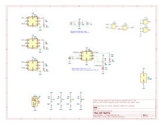

# Edit Machine

A hardware based goal tracker I made for a friend. The goal was simple: have buttons that illuminate LEDs to mark off completed tasks, another LED to flash when all goals are marked off, and to top it all off - a reset switch.

One requirement that was imposed on the project was that **we were to exclusively use material I already had laying about my apartment**, ideally reusing parts harvested off of other circuit boards I kept around for this purpose. 

Mechanically, there was a desire to have a space between the buttons and LEDs to record the goals corresponding to each row.

# Outcome

The final circuit was soldered on a perf(erated) board, which after *much* debugging made me long for a custom circuit board! It would probably surprize no one that this did not work on the first try. I'm relieved and a wee bit stupified that we didn't actually fry any chips in the process.

By placing the chips in the middle I naturally created a space for the goals to be recorded inbetween the LEDs and the buttons. The chip cases can even act as fairly even supports for the writing pad above. *Note: that capacitor in the middle was bent down after the picture was taken.*

# The Circuitry

Originally I was planning to use some basic OR logic chips feeding into themselves to act as the toggles for the LEDs, however the chips I had were incorrectly labelled and were in fact XORs. So I ended up using some 556 timer chips as RS flip-flops for this instead. The driving for the final LED when all the goals are complete was accomplished using a chain of ANDs to combine the outputs for all the LEDs to enable the remaining timer in the 556's.

I have made a preliminary custom circuit board which is a rough proxy of what the prototype was and is included as part of this project. Although it will function, it's dimesions and arrangement may change before I commit to having it made.

## Software Used

The circuit files were initially prepared in KiCad 7.0.5.
